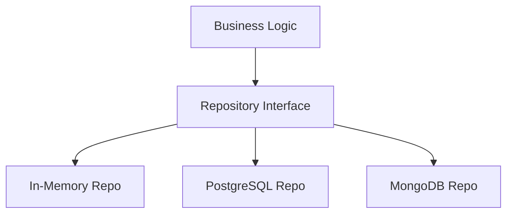

# 🎓 Learning Path: From Developer to Principal Architect in Go

This guide is your roadmap to mastering Go architecture. Each section builds on the economy simulation engine you just created.

---

## 📋 Table of Contents

1. [Foundation Concepts](#foundation-concepts) (You are here)
2. [Intermediate Patterns](#intermediate-patterns)
3. [Advanced Architecture](#advanced-architecture)
4. [Principal Architect Skills](#principal-architect-skills)
5. [Hands-On Exercises](#hands-on-exercises)

---

## 🏗️ Foundation Concepts

### 1. Understanding Go Modules and Packages

#### What You Need to Know

**Module** = A collection of related Go packages
- Defined by `go.mod` file
- Has a unique import path (e.g., `simulation-engine`)
- Manages dependencies

**Package** = A directory containing `.go` files
- All files in a directory must have the same package name
- Package name should match directory name (convention)

#### In Your Project

```
module simulation-engine          ← Module (go.mod)

pkg/model/                        ← Package directory
├── problem.go    (package model)
├── resource.go   (package model)
└── entity.go     (package model)
```

#### Key Rules

1. **Import paths are based on module name:**
   ```go
   import "simulation-engine/pkg/model"
   ```

2. **Exported vs Unexported:**
   ```go
   type Region struct {      // Exported (capital R)
       Name string           // Exported field
       privateData string    // Unexported (lowercase)
   }
   ```

3. **Package initialization:**
   ```go
   // Runs automatically when package is imported
   func init() {
       // Setup code
   }
   ```

#### 📝 Exercise 1.1: Package Visibility

**Task:** In `pkg/model/region.go`, add a private helper function:

```go
// calculateTotalWealth is unexported (lowercase)
func calculateTotalWealth(region *Region) float64 {
    total := 0.0
    for _, person := range region.People {
        total += person.Money
    }
    return total
}

// GetTotalWealth is exported (uppercase) - public API
func (r *Region) GetTotalWealth() float64 {
    return calculateTotalWealth(r)
}
```

**Question:** Why separate the calculation into a private function?
**Answer:** Encapsulation - internal implementation can change without breaking public API.

---

### 2. Structs, Methods, and Receivers

#### Pointer vs Value Receivers

```go
// Value receiver - receives a COPY
func (r Region) GetNameCopy() string {
    return r.Name  // Can read, but changes won't persist
}

// Pointer receiver - receives the ORIGINAL
func (r *Region) SetName(name string) {
    r.Name = name  // Changes persist
}
```

#### When to Use Each?

**Use Pointer Receiver (`*T`) when:**
- Method modifies the receiver
- Struct is large (avoid copying)
- Consistency (if one method uses pointer, all should)

**Use Value Receiver (`T`) when:**
- Method doesn't modify receiver
- Struct is small (int, bool, small structs)
- You want immutability

#### In Your Project

Look at `pkg/model/resource.go`:

```go
// Pointer receiver - modifies the resource
func (r *Resource) Add(amount float64) {
    r.Quantity += amount  // Changes persist
}

// Pointer receiver - modifies the resource
func (r *Resource) Consume(amount float64) bool {
    if r.Quantity >= amount {
        r.Quantity -= amount  // Changes persist
        return true
    }
    return false
}
```

#### 📝 Exercise 1.2: Method Receivers

**Task:** Add these methods to `Person` in `pkg/model/entity.go`:

```go
// CanAfford checks if person can afford a purchase (value receiver - read-only)
func (p Person) CanAfford(amount float64) bool {
    return p.Money >= amount
}

// Spend deducts money from person (pointer receiver - modifies)
func (p *Person) Spend(amount float64) error {
    if !p.CanAfford(amount) {
        return fmt.Errorf("insufficient funds: has %.2f, needs %.2f", p.Money, amount)
    }
    p.Money -= amount
    return nil
}
```

**Question:** Why is `CanAfford` a value receiver but `Spend` is a pointer receiver?

---

### 3. Error Handling Patterns

Go's philosophy: **Explicit error handling**

#### Basic Pattern

```go
result, err := DoSomething()
if err != nil {
    // Handle error
    return err
}
// Use result
```

#### Error Wrapping (Go 1.13+)

```go
func ProcessData(data string) error {
    result, err := validate(data)
    if err != nil {
        // Wrap error with context
        return fmt.Errorf("failed to process data: %w", err)
    }
    return nil
}

// Unwrap to check original error
if errors.Is(err, ErrNotFound) {
    // Handle specific error
}
```

#### Custom Errors

```go
// Define custom error type
type InsufficientFundsError struct {
    Available float64
    Required  float64
}

func (e *InsufficientFundsError) Error() string {
    return fmt.Sprintf("insufficient funds: have %.2f, need %.2f", 
        e.Available, e.Required)
}

// Usage
func (p *Person) Buy(amount float64) error {
    if p.Money < amount {
        return &InsufficientFundsError{
            Available: p.Money,
            Required:  amount,
        }
    }
    p.Money -= amount
    return nil
}
```

#### 📝 Exercise 1.3: Better Error Handling

**Task:** Update `pkg/interaction/trade.go` to use custom errors:

```go
package interaction

import "fmt"

type TradeError struct {
    Reason string
    Buyer  string
    Seller string
}

func (e *TradeError) Error() string {
    return fmt.Sprintf("trade failed (%s → %s): %s", 
        e.Buyer, e.Seller, e.Reason)
}

// Update ExecuteTradeTransaction to return TradeError
```

---

### 4. Slices and Maps Deep Dive

#### Slices Are References

```go
func modifySlice(s []int) {
    s[0] = 999  // Modifies original!
}

func main() {
    nums := []int{1, 2, 3}
    modifySlice(nums)
    fmt.Println(nums)  // [999, 2, 3]
}
```

#### Slice Internals

```
Slice = {
    pointer to underlying array
    length (len)
    capacity (cap)
}
```

#### Common Patterns

```go
// Pre-allocate for performance
people := make([]*Person, 0, 100)  // len=0, cap=100

// Append
people = append(people, newPerson)

// Iterate
for i, person := range people {
    // i is index, person is copy
}

// Iterate with pointer
for i := range people {
    person := people[i]  // Get pointer
}
```

#### Maps

```go
// Create
cache := make(map[string]*Region)

// Set
cache["region1"] = region

// Get (safe)
region, exists := cache["region1"]
if !exists {
    // Handle missing key
}

// Delete
delete(cache, "region1")

// Iterate (order not guaranteed!)
for key, value := range cache {
    // Process
}
```

#### 📝 Exercise 1.4: Add Caching

**Task:** Create a region cache in `pkg/model/region.go`:

```go
// RegionCache stores regions by ID
type RegionCache struct {
    regions map[string]*Region
}

func NewRegionCache() *RegionCache {
    return &RegionCache{
        regions: make(map[string]*Region),
    }
}

func (c *RegionCache) Add(id string, region *Region) {
    c.regions[id] = region
}

func (c *RegionCache) Get(id string) (*Region, bool) {
    region, exists := c.regions[id]
    return region, exists
}

func (c *RegionCache) Remove(id string) {
    delete(c.regions, id)
}
```

---

## 🎯 Intermediate Patterns

### 5. Interfaces: The Heart of Go

#### What Are Interfaces?

**Interface** = A contract specifying behavior (methods)

```go
// Define behavior
type Logger interface {
    Log(message string)
    LogError(err error)
}

// Any type with these methods satisfies the interface
type ConsoleLogger struct{}

func (c *ConsoleLogger) Log(message string) {
    fmt.Println(message)
}

func (c *ConsoleLogger) LogError(err error) {
    fmt.Println("ERROR:", err)
}

// Usage
var logger Logger = &ConsoleLogger{}
logger.Log("Hello")  // Works!
```

#### Interface Satisfaction is Implicit

```go
// No need to declare "implements Logger"
// If it has the methods, it IS the interface
```

#### Small Interfaces Are Better

```go
// Good - single responsibility
type Reader interface {
    Read(p []byte) (n int, err error)
}

// Good - compose small interfaces
type ReadWriter interface {
    Reader
    Writer
}

// Bad - too many methods
type GiantInterface interface {
    Method1()
    Method2()
    Method3()
    // ... 20 more methods
}
```

#### 📝 Exercise 2.1: Add Interfaces to Your Engine

**Task:** Create `pkg/core/interfaces.go`:

```go
package core

import "simulation-engine/pkg/model"

// SimulationEngine defines the contract for any simulation engine
type SimulationEngine interface {
    Run(ticks int)
    GetRegion() *model.Region
    GetCurrentTick() int
}

// Verify Engine implements SimulationEngine
var _ SimulationEngine = (*Engine)(nil)
```

Then update `engine.go`:

```go
func (e *Engine) GetRegion() *model.Region {
    return e.Region
}

func (e *Engine) GetCurrentTick() int {
    return e.CurrentTick
}
```

**Why?** Now you can create different engine implementations (SimpleEngine, DistributedEngine) that all satisfy the same interface.

---

### 6. Dependency Injection

#### The Problem: Tight Coupling

```go
// BAD - hard-coded dependency
type Service struct {
    logger *ConsoleLogger  // Tightly coupled to ConsoleLogger
}

func NewService() *Service {
    return &Service{
        logger: &ConsoleLogger{},  // Can't swap implementations
    }
}
```

#### The Solution: Inject Dependencies

```go
// GOOD - depend on interface
type Service struct {
    logger Logger  // Interface, not concrete type
}

func NewService(logger Logger) *Service {
    return &Service{
        logger: logger,  // Injected from outside
    }
}

// Now you can use ANY logger implementation
service := NewService(&ConsoleLogger{})
service := NewService(&FileLogger{})
service := NewService(&MockLogger{})  // For testing!
```

#### 📝 Exercise 2.2: Inject Logger

**Task:** Refactor `pkg/core/engine.go` to inject logger:

```go
// Create interface in pkg/logging/interfaces.go
package logging

type Logger interface {
    LogTick(tick int)
    LogEvent(message string)
    LogEvents(messages []string)
}

// Update Engine constructor
func NewEngine(region *model.Region, logger logging.Logger, wagePerHour, pricePerUnit, productionRate float64) *Engine {
    return &Engine{
        Region:         region,
        Logger:         logger,  // Injected!
        // ...
    }
}
```

**Benefits:**
- Easy to test (inject mock logger)
- Easy to swap implementations (console, file, remote)
- No hard-coded dependencies

---

### 7. Table-Driven Tests

#### Pattern

```go
func TestCalculateWage(t *testing.T) {
    tests := []struct {
        name     string
        hours    float64
        rate     float64
        expected float64
    }{
        {"standard day", 8.0, 10.0, 80.0},
        {"overtime", 12.0, 10.0, 120.0},
        {"zero hours", 0.0, 10.0, 0.0},
        {"high rate", 8.0, 50.0, 400.0},
    }

    for _, tt := range tests {
        t.Run(tt.name, func(t *testing.T) {
            result := CalculateWage(tt.hours, tt.rate)
            if result != tt.expected {
                t.Errorf("got %.2f, want %.2f", result, tt.expected)
            }
        })
    }
}
```

#### 📝 Exercise 2.3: Add Table-Driven Tests

**Task:** Create `pkg/model/resource_test.go`:

```go
package model

import "testing"

func TestResource_Consume(t *testing.T) {
    tests := []struct {
        name            string
        initialQuantity float64
        consumeAmount   float64
        expectSuccess   bool
        expectedRemaining float64
    }{
        {"sufficient", 100.0, 50.0, true, 50.0},
        {"exact amount", 100.0, 100.0, true, 0.0},
        {"insufficient", 100.0, 150.0, false, 100.0},
        {"zero consume", 100.0, 0.0, true, 100.0},
    }

    for _, tt := range tests {
        t.Run(tt.name, func(t *testing.T) {
            r := NewResource("Test", tt.initialQuantity, "units")
            success := r.Consume(tt.consumeAmount)
            
            if success != tt.expectSuccess {
                t.Errorf("expected success=%v, got %v", tt.expectSuccess, success)
            }
            
            if r.Quantity != tt.expectedRemaining {
                t.Errorf("expected remaining=%.2f, got %.2f", tt.expectedRemaining, r.Quantity)
            }
        })
    }
}
```

---

## 🚀 Advanced Architecture

### 8. Repository Pattern

#### Purpose
Separate data access logic from business logic.



#### Implementation

```go
// pkg/repository/region.go
package repository

import "simulation-engine/pkg/model"

// RegionRepository defines data access interface
type RegionRepository interface {
    Save(region *model.Region) error
    FindByID(id string) (*model.Region, error)
    FindAll() ([]*model.Region, error)
    Delete(id string) error
}

// In-memory implementation
type InMemoryRegionRepo struct {
    regions map[string]*model.Region
}

func NewInMemoryRegionRepo() *InMemoryRegionRepo {
    return &InMemoryRegionRepo{
        regions: make(map[string]*model.Region),
    }
}

func (r *InMemoryRegionRepo) Save(region *model.Region) error {
    r.regions[region.Name] = region
    return nil
}

func (r *InMemoryRegionRepo) FindByID(id string) (*model.Region, error) {
    region, exists := r.regions[id]
    if !exists {
        return nil, fmt.Errorf("region not found: %s", id)
    }
    return region, nil
}

// Later: PostgreSQL implementation
type PostgresRegionRepo struct {
    db *sql.DB
}

func (r *PostgresRegionRepo) Save(region *model.Region) error {
    // SQL INSERT/UPDATE
}
```

#### 📝 Exercise 3.1: Implement Repository

**Task:** Create the repository pattern for regions and update the engine to use it.

---

### 9. Service Layer Pattern

#### Purpose
Encapsulate business logic, coordinate between repositories.

```go
// pkg/service/economy.go
package service

type EconomyService struct {
    regionRepo repository.RegionRepository
    logger     logging.Logger
}

func NewEconomyService(regionRepo repository.RegionRepository, logger logging.Logger) *EconomyService {
    return &EconomyService{
        regionRepo: regionRepo,
        logger:     logger,
    }
}

func (s *EconomyService) RunSimulation(regionID string, ticks int) error {
    // Load region
    region, err := s.regionRepo.FindByID(regionID)
    if err != nil {
        return fmt.Errorf("failed to load region: %w", err)
    }

    // Run simulation
    engine := core.NewEngine(region, s.logger, 10.0, 2.0, 50.0)
    engine.Run(ticks)

    // Save updated region
    if err := s.regionRepo.Save(region); err != nil {
        return fmt.Errorf("failed to save region: %w", err)
    }

    return nil
}
```

---

### 10. Context for Cancellation

#### Purpose
Propagate cancellation signals and deadlines through call stack.

```go
func (s *EconomyService) RunSimulationWithTimeout(ctx context.Context, regionID string, ticks int) error {
    // Create timeout context
    ctx, cancel := context.WithTimeout(ctx, 30*time.Second)
    defer cancel()

    // Check context before expensive operations
    for i := 0; i < ticks; i++ {
        select {
        case <-ctx.Done():
            return ctx.Err()  // Timeout or cancellation
        default:
            // Process tick
        }
    }

    return nil
}
```

---

## 👑 Principal Architect Skills

### 11. System Design Decisions

#### Questions a Principal Architect Asks

1. **Scalability**: Will this handle 10x, 100x, 1000x load?
2. **Maintainability**: Can a new developer understand this in 6 months?
3. **Testability**: Can we test this in isolation?
4. **Observability**: Can we debug this in production?
5. **Security**: What are the attack vectors?
6. **Cost**: What's the infrastructure cost?
7. **Trade-offs**: What are we optimizing for?

#### Example: Choosing Data Storage

| Option | Pros | Cons | When to Use |
|--------|------|------|-------------|
| In-Memory | Fast, simple | Lost on restart | Development, caching |
| SQLite | Simple, file-based | Single writer | Small apps, embedded |
| PostgreSQL | ACID, relational | Complex setup | Structured data |
| MongoDB | Flexible schema | Eventual consistency | Unstructured data |
| Redis | Very fast | Limited queries | Caching, sessions |

---

### 12. API Design Principles

#### RESTful API Design

```go
// Good API design
GET    /api/v1/regions              // List regions
POST   /api/v1/regions              // Create region
GET    /api/v1/regions/{id}         // Get region
PUT    /api/v1/regions/{id}         // Update region
DELETE /api/v1/regions/{id}         // Delete region
POST   /api/v1/regions/{id}/simulate // Run simulation
```

#### Versioning

```go
// URL versioning
/api/v1/regions
/api/v2/regions

// Header versioning
Accept: application/vnd.myapi.v1+json
```

---

## 📚 Hands-On Exercises

### Week 1: Foundation
- [ ] Exercise 1.1: Package visibility
- [ ] Exercise 1.2: Method receivers
- [ ] Exercise 1.3: Custom errors
- [ ] Exercise 1.4: Add caching

### Week 2: Interfaces & DI
- [ ] Exercise 2.1: Add interfaces
- [ ] Exercise 2.2: Inject logger
- [ ] Exercise 2.3: Table-driven tests
- [ ] Create mock implementations for testing

### Week 3: Patterns
- [ ] Exercise 3.1: Repository pattern
- [ ] Add service layer
- [ ] Implement context for cancellation
- [ ] Add configuration management

### Week 4: Real-World Features
- [ ] Save/load simulations to JSON
- [ ] Add REST API server
- [ ] Implement authentication
- [ ] Add metrics and monitoring

---

## 🎯 Assessment Checklist

### Junior → Mid-Level
- [ ] Understand packages and modules
- [ ] Use structs and methods correctly
- [ ] Handle errors properly
- [ ] Write basic tests

### Mid-Level → Senior
- [ ] Design with interfaces
- [ ] Apply dependency injection
- [ ] Write comprehensive tests
- [ ] Understand concurrency basics

### Senior → Principal
- [ ] Make architectural decisions
- [ ] Design scalable systems
- [ ] Mentor others
- [ ] Balance trade-offs
- [ ] Think about observability, security, cost

---

## 📖 Recommended Reading Order

1. **Start Here**: This file
2. **Next**: `QUICKSTART.md` - Run the code
3. **Then**: `ARCHITECTURE.md` - Deep concepts
4. **Finally**: `PROJECT_SUMMARY.md` - Big picture

---

## 🤝 Learning Strategy

1. **Read** the concept
2. **Understand** why it matters
3. **Implement** the exercise
4. **Test** your implementation
5. **Reflect** on what you learned

**Take your time. Master each concept before moving on.**

---

**Next Step:** Start with Exercise 1.1 and work through them sequentially. Each builds on the previous one.
